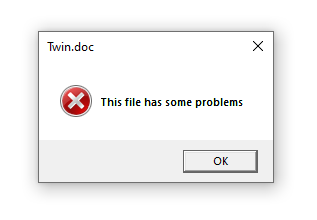
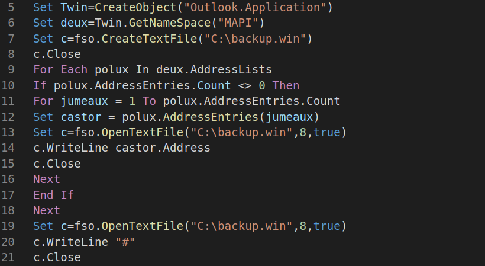
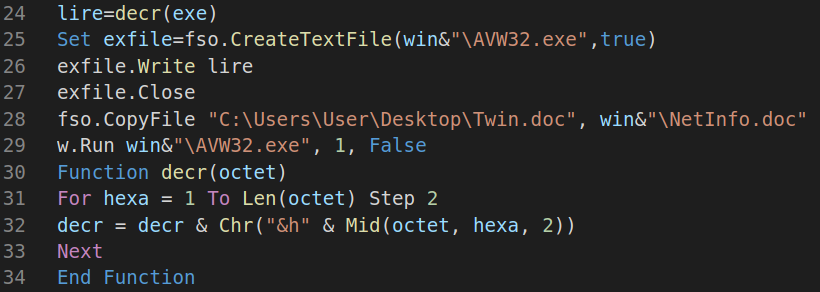

# Summary

```
Name:      Twin.doc
MIME Type: application/msword
Size:      65.536 bytes
MD5:       079275bdaf0058642f3b062b3aef4de3
SHA1:      0fe4a31077176828ec545b7ca3c5e92ea59a7352
SHA256:    46a11a3b520a234a4408010d57a0bd28589526f3248e16fc71ccf4cf8db31595
```

The sample is a Microsoft Word document containing only a blank page that executes a VBA macro when opened, which in turn drops and executes a VB script.

# Macro

The macro, named "twin", was extracted using `oletools`.
It contains two functions: `AutoOpen` and `HelpAbout`.
The first function is executed at the file opening, and displays a fake error message:



After displaying the error message, it creates the file C:\Twin.vbs, and executes it.

# Dropped script

The dropped script saves all Outlook contacts inside C:\backup.win using the `Outlook.Application` object, and adds an extra "#" character at the end of the file:



It also copies the Microsoft Word document it was dropped from into C\Windows\NetInfo.doc:


Finally, it decodes an executable embedded inside the `exe` variable, saves it to C:\Windows\AVW32.exe and executes it:



# Dropped executable

## Static analysis

Looking at the [VirusTotal report](https://www.virustotal.com/gui/file/ece298679b5588da28538bdf7e2f8bbf71ede40b7c591c658a607a7eded7234d/details) of the file, we discover its compilation timestamp is set in the year 2050, but we also see it's an executable packed with UPX 2.90, which implies the malware was probably made around 2006 (UPX 2.90 was released on 8 October 2006).

Looking at the optional header with CFF Explorer, we see that the file was apparently made for Windows version 1.0, which doesn't correspond to any known Windows release:


After unpacking the executable and loading it in IDA, the autoanalysis generates a lot of "sp-analysis failed" error messages, and we can find (after fixing the disassembly output) some strings between chunks of code:


It's possible to remove the SP-analysis failed messages either by changing the purged bytes of the called functions and the SP value near the call instructions, or by loading the executable with the "Trace stack pointer" and "Perform full stack pointer analysis" options disabled. However, by choosing the second method, IDA won't be able add the automatic comments to the arguments of WinAPI calls.

As can be seen, the program contains mixed code and data and makes heavy use of call instructions to jump between chunks.
Since the call instruction pushes the address next to it on to the stack, those lines have the same effect of the instruction `push str_address`:


## Behavior

The software creates a new entry named "AntiVirus Freeware" with content "C:\Windows\AVW32.exe" inside the `HKLM\Software\Microsoft\Windows\CurrentVersion\Run` registry key, deletes the VB script that was previously dropped, and waits until the PC is connected to the Internet.

After an internet connection has been established, it loads C:\backup.win (the Outlook contact list) in memory using `CreateFileA`, ` CreateFileMappingA` and `MapViewOfFile`, and checks if it contains at least one entry, otherwise it exits.

If the contact list is not empty, it parses it and sends a mail to every address inside it by calling `MAPISendMail`, with subject "A comical Story for you." and with the following content:

```
I send you a comical story found on the Net.

Best Regards. You friend.
```

It also attaches the Microsoft Word document that was copied early inside the Windows folder as "comical_story.doc".

I provided the IDA database I used to analyze the unpacked sample as an IDC script file inside files/AVW32.idc, which you can load by opening AVW32.exe in IDA (md5: `d64e427efbfedf6ac90523ce2fb8b737`) and executing the script with Alt+F7.
