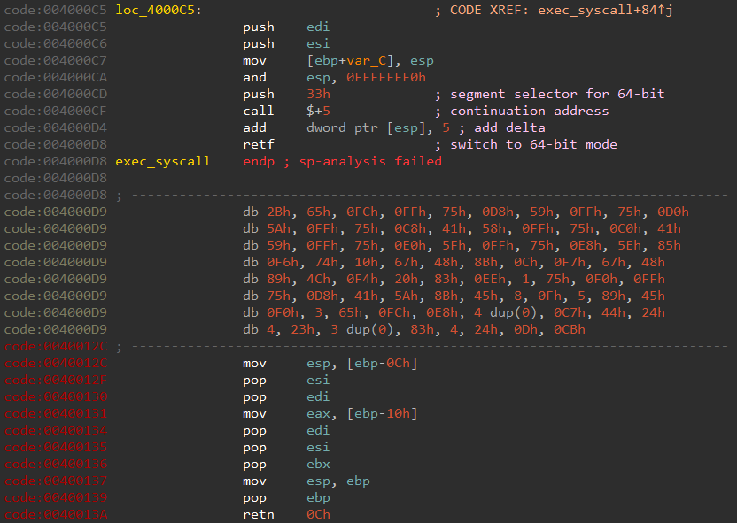

# Summary

```
Name:      94e6f44.exe
MIME Type: application/x-dosexec
Size:      252.491 bytes
MD5:       94e6f4420d6e1de301c2b192dc1f28a4
SHA1:      52aa217d4acf94d3ed18c298068f580fb1593690
SHA256:    e5ba1cfe2454e107c54219a4368bbe6921069e3e51608079bbfcfc0593caa4a0
```

The sample is a NSIS installer that drops and executes a variant of FormBook.

It contains 3 stages before executing the final payload, and makes use of some well-known obfuscation and evasion techniques such as API hashing, process hollowing and runtime code decryption and execution.

Since the FormBook malware famility was already studied extensively, I decided to not analyze the variant dropped by this loader, but instead I opted to only extract the payload configuration, which can be found in files/payload_config.txt.

# Stage 1

Opening the sample with Detect It Easy, it shows the executable is a NSIS installer.


To extract the install script, I opened the file with 7zip 15.05 (the latest version able to decompile NSIS installers), and looked at the function `.onInit`:


The installation script is full of junk code, and the only interesting parts are the extracted files and the dll function call on line 616, which executes an exported function of pvznme.dll.

# Stage 2

The function starts by getting the address of kernelbase.dll from the Process Environment Block


After getting the address of the dll, the main function resolves some imports at runtime through API hashing (which I didn't bother to look into)


It then allocates a chunk of memory using `VirtualAlloc`, reads and decrypts the content of the file ccrwz into the previously allocated buffer, and then jumps to it.


# Stage 3

The first part of this stage is pretty similar to the one explained above: the shellcode starts by parsing the PEB, but this time it loads the base address of kernel32.dll, and deobfuscates some imports through API hashing again. The hashing algorithm was pretty simple, and I wrote a script to resolve the hashes statically, which can be found in files/resolve_hashes.py.
Here is the function to hash a string, rewritten in python:

```python
from fixedint import UInt32

def hash_string(s):
    eax = UInt32(0x2326)

    for ch in s:
        eax += (eax << 7) | (eax >> 1)
        eax += ch

    return eax
```

After getting the addresses of the first batch of hashed functions, it reads and decrypts the content of the file xwk1x6f1b00prs867bb. This time the payload is a PE executable, as can be seen from the first few bytes of the header after running the decryption routine:


The executable is actually a variant of FormBook, as stated in the summay, and can be found in files/bd6a31f.exe.

After decrypting the payload, the process calls the function at the virtual address `0x400D80`, that checks the relocation directory size header field of the payload, and performs process hollowing on a copy of the currently running process if there are no relocations, which is the scenario encountered with this sample.

If the payload has relocations, it doesn't hollow the child process, but it creates and starts a new thread on its memory space instead.

## Process hollowing

The process hollowing function, which starts at address `0x4010A8`, starts by loading the base address of kernel32.dll and resolving some of the imports, like in the previous stages.

After loading the necessary imported functions, the sample creates another instance of itself in suspended state by calling `CreateProcessW` with creation flags `CREATE_NO_WINDOW | CREATE_SUSPENDED` and saves the thread context for later use.


After spawning the suspended process, it starts the actual process hollowing procedure by calling a wrapper for the function `NtUnmapViewOfSection` (VA `0x400368`) and allocates a new chunk of memory inside the suspended process.

It then uses a wrapper of `NtWriteVirtualMemory` (VA `0x400267`) to write the payload image header, text section and image base inside the previously allocated memory.

After this, it restores the thread context and resumes the process execution with `NtResumeThread`.

## Heaven's Gate

The function at VA `0x400005`, which is responsible for syscall execution, makes use of the Heaven's Gate technique to hinder dynamic analysis. This function is called only when the process is running under WoW64:


In the last part of the function at `0x400005`, we can see the setup for the 64-bit mode switch by pushing the segment selector `0x33`, the 64-bit code offset (and its fixup) and the actual mode switch with the `retf` instruction:



To correctly disassemble this code, I decided to extract the 64-bit chunk and analyze it separately with IDA x64, but it's also possible to load the entire executable as 64-bit, set the text register as 32-bit code and add a new 64-bit segment only for the 64-bit section, which I deemed too complicated this time.


The above code puts the parameters from the stack into the expected registers according to the [Windows x64 syscall calling convention](https://docs.microsoft.com/en-us/cpp/build/x64-calling-convention), executes the `syscall` instruction and switches back to 32-bit mode.