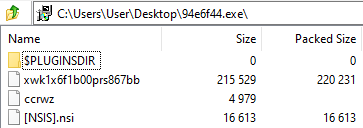
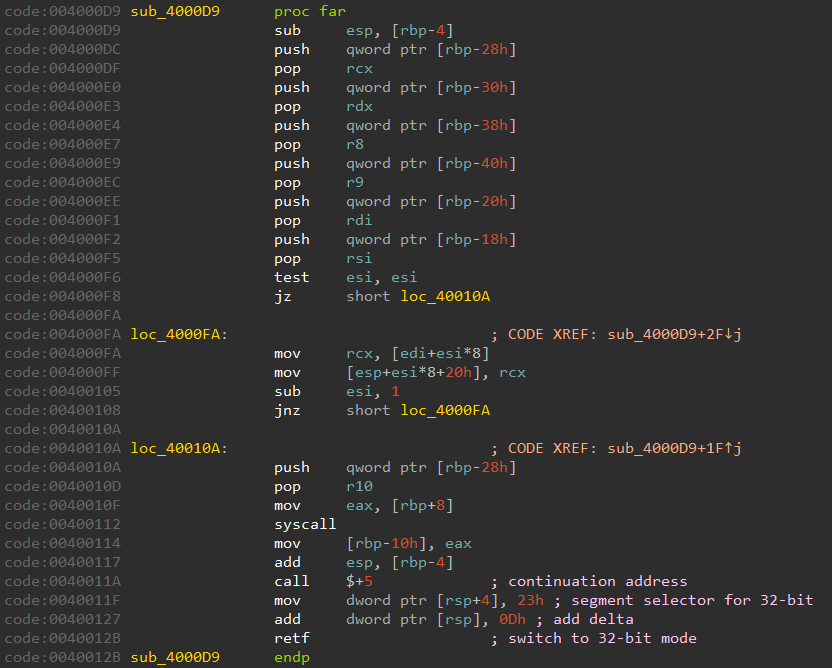

# Summary

```
Name:      94e6f44.exe
MIME Type: application/x-dosexec
Size:      252.491 bytes
MD5:       94e6f4420d6e1de301c2b192dc1f28a4
SHA1:      52aa217d4acf94d3ed18c298068f580fb1593690
SHA256:    e5ba1cfe2454e107c54219a4368bbe6921069e3e51608079bbfcfc0593caa4a0
```

The sample is a NSIS installer that drops and executes a variant of FormBook.

It contains 3 stages before executing the final payload, and makes use of some well-known obfuscation and evasion techniques such as API hashing, process hollowing and runtime code decryption and execution.

# Stage 1

Since we're dealing with a NSIS installer executable, it's possible to use 7zip to see the extracted files. Opening the sample using 7zip 15.05 allows to extract the installation script too.




The archive contains a dll and two encrypted binary blobs and a dll, which will probably be decrypted at runtime.

Looking at the installation script, we will notice it's full of junk code, except for the first few lines of the  `.onInit` function, which are responsible for extracting the two encrypted blobs and executing an exported function of pvznme.dll:

```NSIS
Function .onInit
  InitPluginsDir
  SetOutPath $INSTDIR
  File xwk1x6f1b00prs867bb
  File ccrwz
  pvznme::vmfuyjpba
```

# Stage 2

After loading the exported function in IDA and manipulating the disassembly listing until it looked clear enough, I obtained the following equivalent C code:

```C
void vmfuyjpba() {
    DWORD NumberOfBytesRead;
    WCHAR path[520];
    WCHAR fname[6] = "ccrwz";

    // resolve imports dynamically
    LPVOID kernelbase = load_kernelbase();
    LPVOID VirtualAlloc = resolve_hash(kernelbase, 0x7554284C);
    LPVOID CreateFileW = resolve_hash(kernelbase, 0x79141C25);
    LPVOID ReadFile = resolve_hash(kernelbase, 0x42D79F56);
    LPVOID GetFileSize = resolve_hash(kernelbase, 0x060F1B35);
    LPVOID GetTempPathW = resolve_hash(kernelbase, 0xDC2192B4);

    // get encrypted shellcode path
    GetTempPathW(259, path);
    lstrcatW(path, fname);

    // read encrypted shellcode and load it into memory
    HANDLE hFile = CreateFileW(path, GENERIC_READ, FILE_SHARE_READ | FILE_SHARE_WRITE | FILE_SHARE_DELETE, 0, OPEN_EXISTING, FILE_ATTRIBUTE_NORMAL, 0);
    SIZE_T shellcode_size = GetFileSize(hFile, 0);
    LPVOID shellcode = VirtualAlloc(0, shellcode_size, MEM_COMMIT | MEM_RESERVE, PAGE_EXECUTE_READWRITE);
    ReadFile(hFile, shellcode, shellcode_size, &NumberOfBytesRead, 0);

    // decrypt shellcode
    for (SIZE_T i = 0; i < shellcode_size; i++) {
        shellcode[i] += 0xAD;
        shellcode[i] ^= 0xF7;
    }

    __asm { jmp eax }; // jump to shellcode
}
```

The above code can be summarized as follows:

1. Loads the string "ccrwz" as a stack string
2. Gets the address of kernelbase.dll from the PEB and resolves some imports through API hashing
3. Appends the encrypted shellcode name to the %TEMP% directory path
4. Allocates some memory with RWX permission and reads the file into a buffer
5. Decrypts the buffer previously written
6. Jumps to the address of the decrypted shellcode

The hash function used by `resolve_hash` is quite simple:

```python
from fixedint import UInt32

def hash_string(s):
    n = UInt32(0x1B63A)

    for ch in s:
        n = ch + 33 * n

    return n
```

# Stage 3

The first part of this stage is pretty similar to the one shown above: the shellcode starts by parsing the PEB to get the address of kernel32.dll, and deobfuscates some imports through API hashing again. The hashing algorithm is different from the previous one:

```python
from fixedint import UInt32

def hash_string(s):
    n = UInt32(0x2326)

    for ch in s:
        n += (n << 7) | (n >> 1)
        n += ch

    return n
```

After getting the addresses of the first batch of hashed functions, it reads and decrypts the content of the file xwk1x6f1b00prs867bb using a custom decryption routine. This time the payload is a PE executable, as can be seen from the first few bytes of the header after running the decryption routine:


After the final payload is decrypted, the malware resolves another batch of imported functions dynamically, checks the relocation directory size header field of the payload, and performs process hollowing on a copy of the currently running process if there are no relocations, which is the scenario encountered in this sample.

If the payload has relocations, it doesn't hollow the child process, but it creates and starts a new thread on its memory space instead.

## Process hollowing

After loading the necessary imported functions from kernel32.dll, the sample creates another instance of itself in suspended state by calling `CreateProcessW` with creation flags `CREATE_NO_WINDOW | CREATE_SUSPENDED` and saves the thread context for later use.


After spawning the suspended process, it executes the syscall for `NtUnmapViewOfSection` and allocates a new chunk of memory inside the suspended process.

It then calls `NtWriteVirtualMemory` (always via syscall) to write the payload image header, text section and image base inside the previously allocated memory.

After this, it restores the thread context and resumes the process execution with `NtResumeThread`.

## Syscall number retrieval

Each time the malware needs to execute a native Windows function (for example `NtUnmapViewOfSection`), a copy of ntdll.dll is loaded from the disk and mapped onto memory (to bypass any installed in-memory hooks). It then loads the address of the required function though API hashing and loops through the function prologue to find a  `mov eax, <dword>` instruction (opcode `0xB8`), and returns its second argument:


## Heaven's Gate

When the process is detected to be running under WoW64, the payload makes use of the Heaven's Gate technique to hinder dynamic analysis:


In the last part of the `exec_syscall` function, we can see the setup for the 64-bit mode switch by pushing the segment selector `0x33`, the 64-bit code offset (and its fixup) and the actual mode switch with the `retf` instruction.

To correctly disassemble this code, I decided to extract the 64-bit chunk and analyze it separately with IDA x64, but it's also possible to load the entire executable as 64-bit, set the text register as 32-bit code and add a new 64-bit segment only for the 64-bit section.



The above code puts the parameters from the stack into the expected registers according to the [Windows x64 syscall calling convention](https://docs.microsoft.com/en-us/cpp/build/x64-calling-convention), executes the `syscall` instruction and switches back to 32-bit mode.